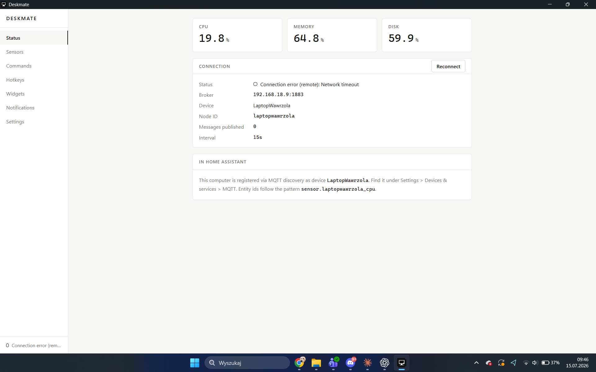
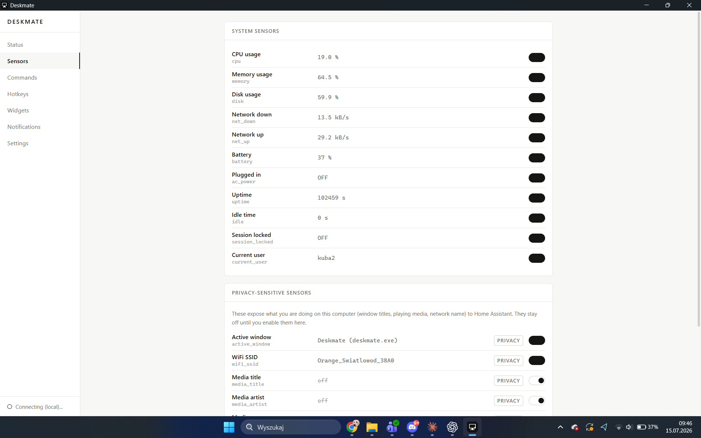
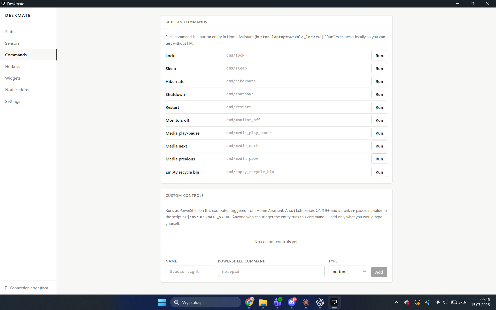
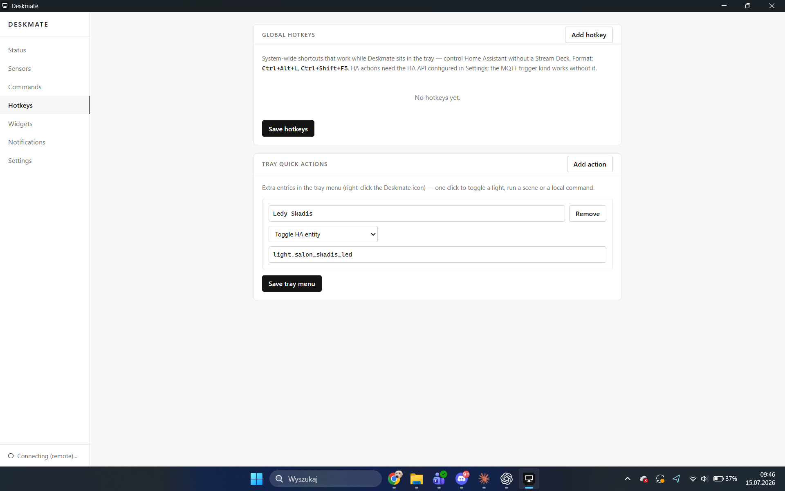
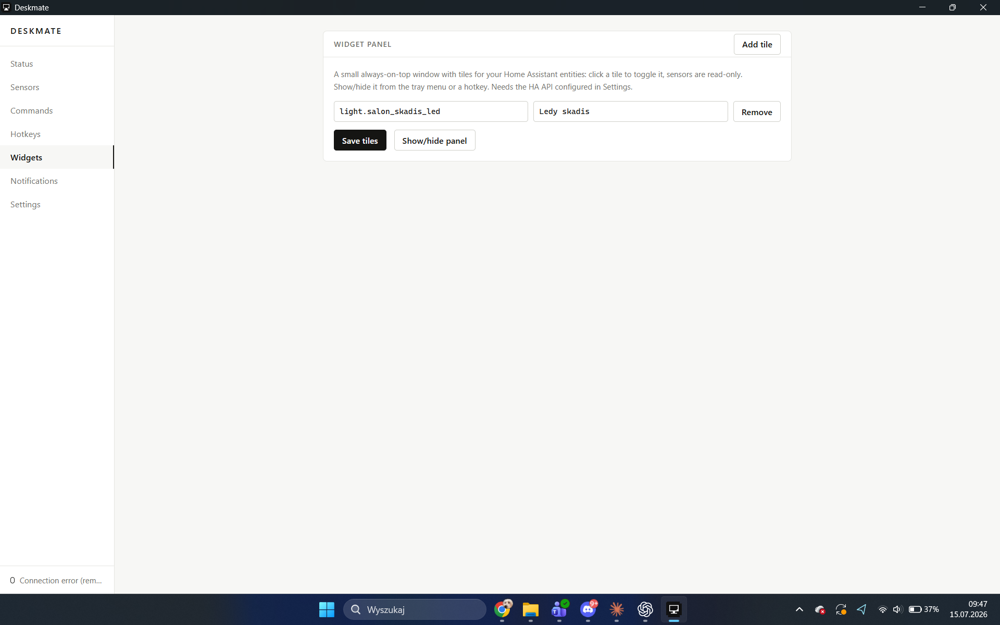
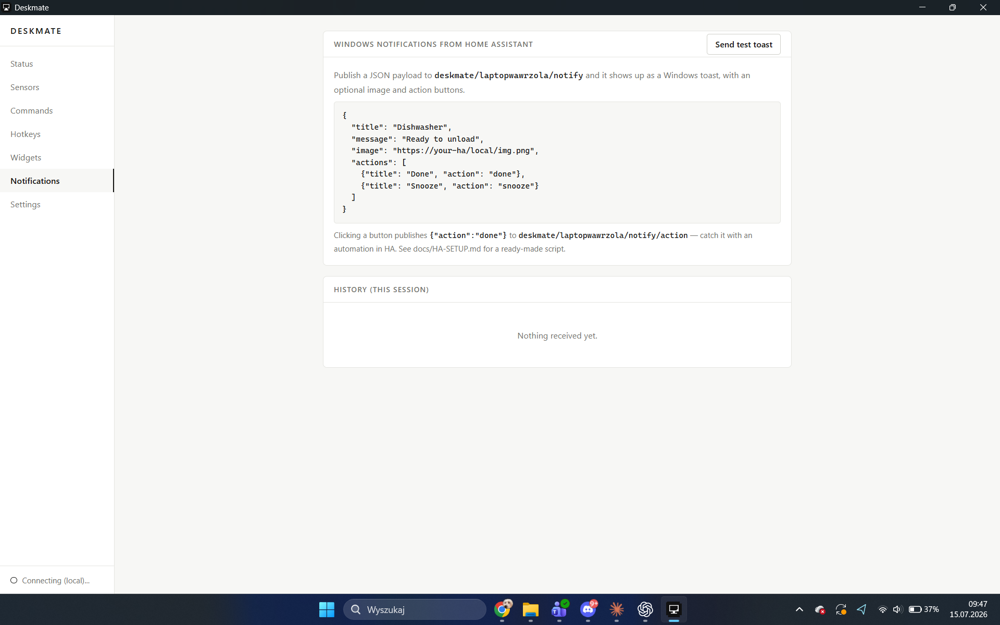

# Deskmate

A modern, open-source Windows companion for Home Assistant — the spiritual
successor to HASS.Agent. Your PC shows up in Home Assistant as a device with
sensors, buttons, switches and notifications, and your keyboard becomes a
remote control for your home. Five-field setup instead of a config maze.

Runs natively on Windows 11, both **x64 and ARM64** (Snapdragon laptops
included) — no emulation, no C toolchain, one ~2.5 MB installer per arch.

**What kind of app is this?** A regular Windows desktop app (Tauri, so a small
native binary + webview UI) that lives in the **system tray**. There is no
separate background service — while your Windows user session is active,
Deskmate runs, connects to your MQTT broker, and keeps your entities in sync.
Closing the window minimizes it to the tray; quitting from the tray menu (or
signing out) actually stops it. It starts with Windows if you enable autostart
in Settings.

**Why not just use HASS.Agent (or its [active fork](https://github.com/hass-agent/HASS.Agent))?**
Both are solid projects and if they already cover what you need, use them. Deskmate
exists because of two gaps I personally kept hitting: no native **ARM64** build
(so no support for Snapdragon/Copilot+ PCs without emulation), and a handful of
sensors/entities I wanted that weren't there (camera/mic-in-use, keep-awake as a
switch, MQTT device-trigger hotkeys, a widget panel). If you're on x64 and the
fork already does what you want, there's no reason to switch.

## Table of contents

- [Screenshots](#screenshots)
- [Highlights](#highlights)
- [Requirements](#requirements)
- [Connection transports](#connection-transports)
- [Install](#install)
- [Building from source](#building-from-source)
- [Notifications from Home Assistant](#notifications-from-home-assistant)
- [Security model](#security-model)
- [Security assessment](docs/SECURITY.md)
- [Known issues](#known-issues)
- [Project docs](#project-docs)

## Screenshots

| Status | Sensors | Commands |
|---|---|---|
|  |  |  |

| Hotkeys | Widgets | Notifications |
|---|---|---|
|  |  |  |

## Highlights

### Your PC in Home Assistant (MQTT discovery, zero YAML)
- **System sensors** — CPU, memory, disk, network up/down, battery, plugged-in,
  uptime, idle time, session locked, current user. Published on your interval,
  entities appear automatically under one device.
- **Privacy-aware sensors (opt-in, off by default)** — active window title,
  WiFi SSID, clipboard content, camera-in-use, microphone-in-use, currently
  playing media (title / artist / app / state). Each one is enabled
  consciously, per sensor; disabling removes the entity from HA.
- **Remote commands** — lock, sleep, hibernate, shutdown, restart, monitors
  off, media play/pause/next/prev, empty recycle bin, master volume slider.
- **Custom controls** — your own PowerShell commands exposed as HA **button,
  switch or number** entities. Commands are independently enabled and can
  require local confirmation; values reach scripts only through the sanitized
  `$env:DESKMATE_VALUE` environment variable.
- **Keep awake switch** — an HA switch that stops the PC from sleeping and the
  display from turning off (great for backups and downloads).
- **Notifications** — publish JSON to one MQTT topic, get a native Windows
  toast with title, message, an image, and **action buttons**; the clicked
  button is published back to HA, so an automation can react to it.
- **Remote interaction (opt-in)** — HA can type text into the focused window,
  drive a presentation, open an allowlisted HTTP(S) origin, put text on the
  clipboard, or make the PC **speak**. Clipboard read and write each support
  Off / Confirm / Automatic modes.

### Your home on the PC
- **Global hotkeys** — system-wide shortcuts that work while Deskmate sits in
  the tray. Bind `Ctrl+Alt+L` to toggle a light, run any HA service with JSON
  data, fire a local command, or publish an **MQTT device trigger** that shows
  up in HA's automation editor. Control your home without a Stream Deck.
- **Widget panel** — a small always-on-top window with tiles for the entities
  you pick: click to toggle lights and switches, watch sensor values live.
  Summon it with a hotkey or from the tray.
- **Tray quick actions** — your own entries in the tray menu: one click to run
  a scene, toggle an entity, or execute a local command.
- **Dual connectivity with failover** — a local broker/HA address plus an
  optional fallback (e.g. a Tailscale IP). Leave home, Deskmate reconnects
  through the fallback by itself.

### Elgato Stream Deck
A standalone [Stream Deck plugin](streamdeck-plugin/) (SDK v2, TypeScript) with
Toggle Entity / Call Service / Activate Scene actions and live key state over
WebSocket. Works independently of the desktop app.

## Requirements

- Windows 11 (x64 or ARM64)
- An MQTT broker reachable from the PC, or Home Assistant with the optional
  Deskmate Link integration. MQTT remains the default.
- Optional, for hotkeys/widgets/tray acting on HA entities: a **long-lived
  access token** (HA profile → Security) entered in Deskmate Settings.

## Connection transports

Deskmate supports two parallel transports. **MQTT is the default** and keeps
the existing discovery, text entities and MQTT device-trigger hotkeys. TLS with
a verified certificate is recommended; plain MQTT is an explicit
trusted-LAN-only mode.

**Deskmate Link** connects directly to its Home Assistant custom integration
over WebSocket. A pairing key authenticates the handshake, then every
application frame is encrypted with independent session keys and replay
protection. The key is stored in Windows Credential Manager. See
[docs/LINK.md](docs/LINK.md) for setup and current entity coverage.

## Install

Grab the installer from Releases (`Deskmate_x64-setup.exe` or
`Deskmate_arm64-setup.exe`), run it, then:

1. Start Deskmate.
2. Select TLS, enter the broker hostname from its certificate, port 8883 and a
   dedicated MQTT username/password. A private CA can be selected as a PEM file.
3. Save & connect. Done — check Settings → Devices & services → MQTT in HA.
4. (Optional) Settings → Home Assistant API: HA URL + token — this unlocks
   hotkeys/widgets/tray actions that talk to HA directly.

Configuration lives in `%APPDATA%\Deskmate\config.json`. Secrets (MQTT
password, Link pairing key, HA token) are stored in **Windows Credential
Manager**, never on disk in plain text.

Security migration note: configs created before these controls move to
TLS/8883, clipboard Off and custom commands disabled/confirmation-required.
Review Settings after upgrading; credentials remain in Credential Manager.

## Building from source

```
npm install
npm run tauri dev            # development
npm run tauri build          # release for the current architecture
npm run tauri build -- --target x86_64-pc-windows-msvc   # cross to x64
```

Toolchain: Node 20+, Rust stable (`aarch64-pc-windows-msvc` and/or
`x86_64-pc-windows-msvc`). No C compiler needed on either architecture.

## Notifications from Home Assistant

See [docs/HA-SETUP.md](docs/HA-SETUP.md) for copy-paste scripts. Quick test
from Developer Tools → Actions:

```yaml
action: mqtt.publish
data:
  topic: deskmate/YOUR_NODE_ID/notify
  payload: >-
    {"title": "Backup", "message": "Run nightly backup now?",
     "image": "http://your-ha:8123/local/img.png",
     "actions": [{"title": "Run", "action": "run"},
                 {"title": "Skip", "action": "skip"}]}
```

The clicked button arrives as `{"action": "run"}` on
`deskmate/YOUR_NODE_ID/notify/action`. The node id is shown on the Status page.

## Security model

- **MQTT TLS is the default.** Deskmate verifies broker certificates through
  Windows Schannel or a selected PEM CA. Plain MQTT is explicitly marked
  insecure and cannot be used with a fallback broker address.
- Use a dedicated MQTT identity and per-node ACL. Anyone allowed to publish to
  a device's built-in command topics can control that PC; topic names are not
  secrets.
- **MQTT payloads are never executed.** Built-ins use a fixed allowlist. Custom
  PowerShell commands are disabled until enabled, can require confirmation, and
  receive only a sanitized environment variable.
- Clipboard publication and writes are independent, default-off capabilities
  with Off / Confirm / Automatic modes. Both stop while Windows is locked;
  writes are size-limited and rate-limited.
- `open_url` and notification images require strict HTTP(S) parsing and an exact
  allowlisted origin. Configured HA API origins are allowed automatically.
- Retained MQTT messages are ignored for commands and notifications, preventing
  replay after reconnect. TTS, clipboard, toast fields and notification rate
  are bounded.
- MQTT passwords and HA long-lived tokens live in Windows Credential Manager,
  never in `config.json`. HA fallback REST URLs are HTTPS-only. Security events
  are logged locally without payload contents or credentials.

Read the full threat model, exact Mosquitto TLS/ACL setup, clipboard semantics,
residual risks and deployment checklist in [docs/SECURITY.md](docs/SECURITY.md).

## Known issues

- **Toast action buttons don't render on every machine.** The toast shows with
  the correct title, message, image and "HomeOS" branding, but the action
  buttons (from the `actions` field in the notify payload) sometimes don't
  appear — even though the app builds and sends them correctly (protocol
  activation, `deskmate:action?name=...`). Root cause not yet identified;
  suspected causes include Windows requiring a COM background activator
  (`ToastActivatorCLSID`) for interactive buttons rather than plain protocol
  activation, or per-machine Focus Assist/notification settings. If you hit
  this, please open an issue with your Windows build number — reports help
  narrow it down.
- In-process WinRT toast delivery (`.show()`) fails on some machines due to a
  COM apartment issue in the unpackaged process; Deskmate transparently falls
  back to spawning a short-lived `powershell.exe` to render the toast instead.
  This is expected and handled, not a bug — mentioned here for transparency.

## Project docs

- [docs/ARCHITECTURE.md](docs/ARCHITECTURE.md) — how it is put together
- [docs/HA-SETUP.md](docs/HA-SETUP.md) — Home Assistant side setup
- [docs/LINK.md](docs/LINK.md) — encrypted direct transport setup
- [docs/ROADMAP.md](docs/ROADMAP.md) — where this is going
- [docs/SECURITY.md](docs/SECURITY.md) — security threat model and hardening plan
- [docs/RELEASE-0.4.0.md](docs/RELEASE-0.4.0.md) — GitHub release notes for Deskmate Link, Files and hardware sensors
- [streamdeck-plugin/README.md](streamdeck-plugin/README.md) — Stream Deck plugin
- [HANDOFF.md](HANDOFF.md) — working state, for contributors and AI agents (Polish)

## License

MIT
