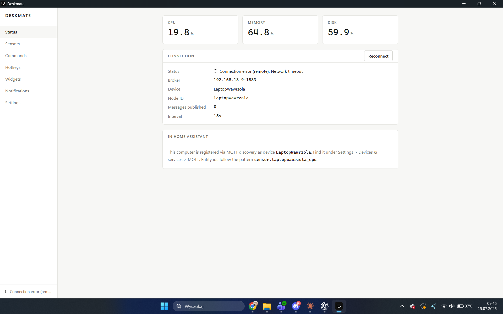
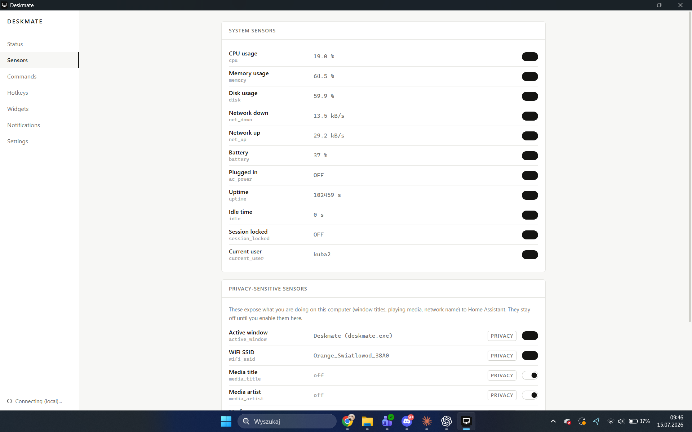
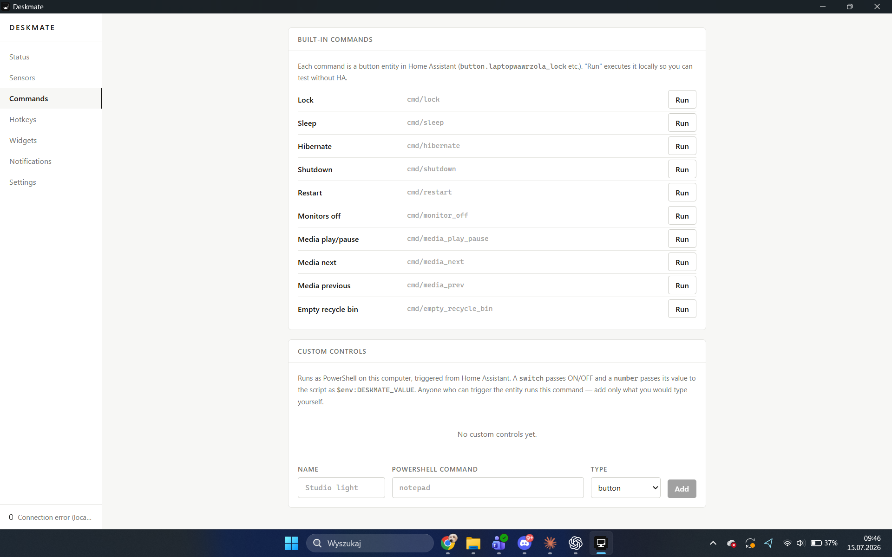
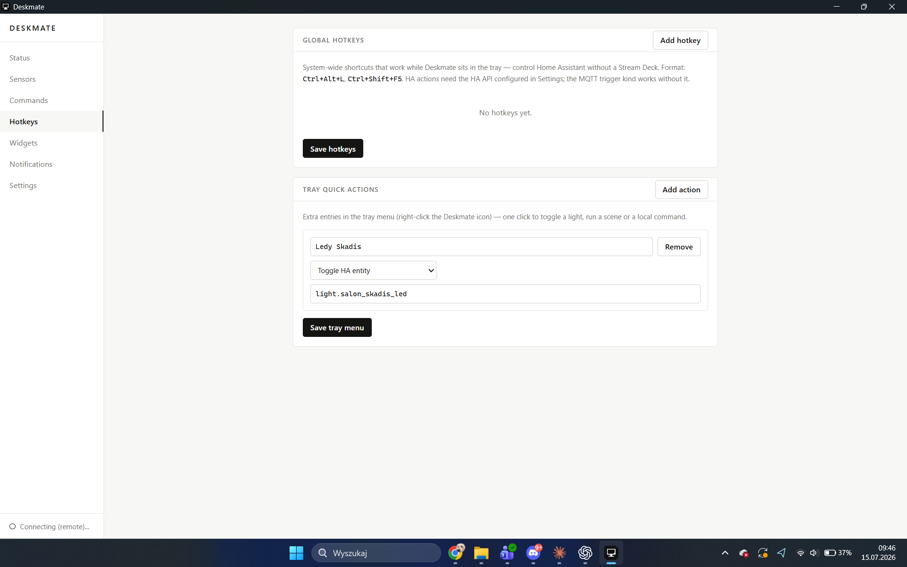
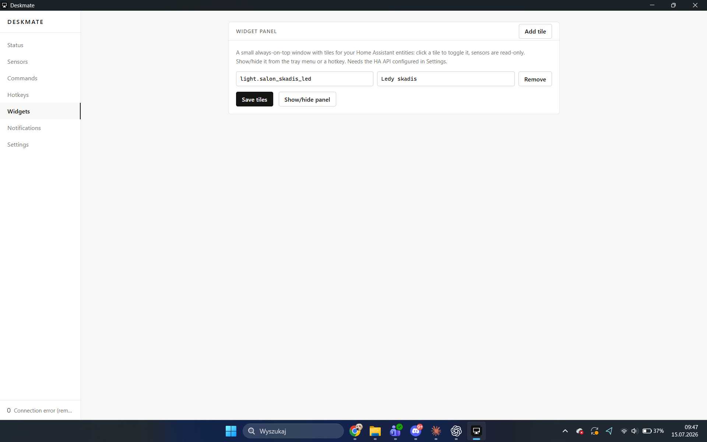
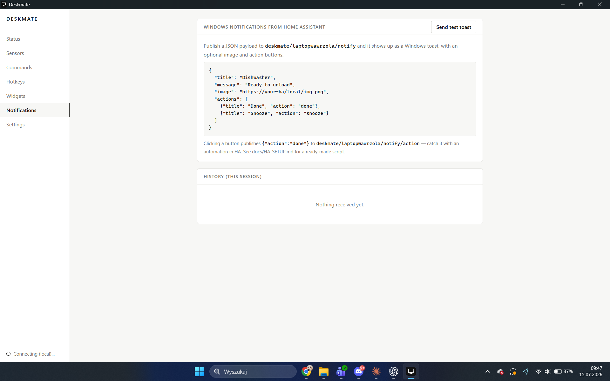

# Deskmate

A modern, open-source Windows companion for Home Assistant — the spiritual
successor to HASS.Agent. Your PC shows up in Home Assistant as a device with
sensors, buttons, switches and notifications, and your keyboard becomes a
remote control for your home. Five-field setup instead of a config maze.

Deskmate connects through **Deskmate Link**: its own Home Assistant integration
and an encrypted WebSocket, set up with a single pairing key and no broker to
install. MQTT is still fully supported for setups that already run one, but Link
is the recommended path since 0.5.0. Link also carries hardware sensors (GPU,
VRAM, per-volume disks, temperatures) and opt-in, read-only, allowlisted
**remote file access** from Home Assistant.

[](https://my.home-assistant.io/redirect/hacs_repository/?owner=JakubWawrzola&repository=deskmate&category=integration)

Setting this up with an AI assistant? Point it at
[docs/AI-DEPLOY.md](docs/AI-DEPLOY.md) — it contains the whole procedure,
including what to tell you and what to avoid.

Runs natively on Windows 11, both **x64 and ARM64** (Snapdragon laptops
included) — no emulation, no C toolchain, one ~2.5 MB installer per arch.

**What kind of app is this?** A regular Windows desktop app (Tauri, so a small
native binary + webview UI) that lives in the **system tray**. There is no
separate background service — while your Windows user session is active,
Deskmate runs, connects to Home Assistant (your MQTT broker or the encrypted
Deskmate Link channel), and keeps your entities in sync.
Closing the window minimizes it to the tray; quitting from the tray menu (or
signing out) actually stops it. It starts with Windows if you enable autostart
in Settings.

**Why not just use HASS.Agent (or its [active fork](https://github.com/hass-agent/HASS.Agent))?**
Both are solid projects and if they already cover what you need, use them. Deskmate
exists because of two gaps I personally kept hitting: no native **ARM64** build
(so no support for Snapdragon/Copilot+ PCs without emulation), and a handful of
sensors/entities I wanted that weren't there (camera/mic-in-use, keep-awake as a
switch, MQTT device-trigger hotkeys, a widget panel). If you're on x64 and the
fork already does what you want, there's no reason to switch.

## Table of contents

- [Screenshots](#screenshots)
- [Highlights](#highlights)
- [Requirements](#requirements)
- [Connection transports](#connection-transports)
- [Install](#install)
- [Building from source](#building-from-source)
- [Notifications from Home Assistant](#notifications-from-home-assistant)
- [Security model](#security-model)
- [Security assessment](docs/SECURITY.md)
- [Known issues](#known-issues)
- [Project docs](#project-docs)

## Screenshots

| Status | Sensors | Commands |
|---|---|---|
|  |  |  |

| Hotkeys | Widgets | Notifications |
|---|---|---|
|  |  |  |

## Highlights

### Your PC in Home Assistant (MQTT discovery, zero YAML)
- **System sensors** — CPU, memory, disk, network up/down, battery, plugged-in,
  uptime, idle time, session locked, current user. Published on your interval,
  entities appear automatically under one device.
- **Privacy-aware sensors (opt-in, off by default)** — active window title,
  WiFi SSID, clipboard content, camera-in-use, microphone-in-use, currently
  playing media (title / artist / app / state). Each one is enabled
  consciously, per sensor; disabling removes the entity from HA.
- **Remote commands** — lock, sleep, hibernate, shutdown, restart, monitors
  off, media play/pause/next/prev, empty recycle bin, master volume slider.
- **Custom controls** — your own PowerShell commands exposed as HA **button,
  switch or number** entities. Commands are independently enabled and can
  require local confirmation; values reach scripts only through the sanitized
  `$env:DESKMATE_VALUE` environment variable.
- **Keep awake switch** — an HA switch that stops the PC from sleeping and the
  display from turning off (great for backups and downloads).
- **Hardware sensors (0.4.0)** — GPU usage and temperature, VRAM, per-volume
  disk free/usage, disk read/write speed, CPU temperature where cheaply
  available. Sensors that cannot be read on a given machine are simply not
  declared — no fake entities.
- **Remote file access over Link (0.4.0, opt-in)** — read-only browsing and
  reading of explicitly allowlisted folders from Home Assistant (e.g. via a
  voice assistant tool), with path normalization, size caps, rate limiting
  and a local security log. Disabled by default with an empty allowlist.
- **Notifications** — publish JSON to one MQTT topic, get a native Windows
  toast with title, message, an image, and **action buttons**; the clicked
  button is published back to HA, so an automation can react to it.
- **Remote interaction (opt-in)** — HA can type text into the focused window,
  drive a presentation, open an allowlisted HTTP(S) origin, put text on the
  clipboard, or make the PC **speak**. Clipboard read and write each support
  Off / Confirm / Automatic modes.

### Your home on the PC
- **Global hotkeys** — system-wide shortcuts that work while Deskmate sits in
  the tray. Bind `Ctrl+Alt+L` to toggle a light, run any HA service with JSON
  data, fire a local command, or publish an **MQTT device trigger** that shows
  up in HA's automation editor. Control your home without a Stream Deck.
- **Widget panel** — a small always-on-top window with tiles for the entities
  you pick: click to toggle lights and switches, watch sensor values live.
  Summon it with a hotkey or from the tray.
- **Tray quick actions** — your own entries in the tray menu: one click to run
  a scene, toggle an entity, or execute a local command.
- **Dual connectivity with failover** — a local broker/HA address plus an
  optional fallback (e.g. a Tailscale IP). Leave home, Deskmate reconnects
  through the fallback by itself.

### Elgato Stream Deck
A standalone [Stream Deck plugin](streamdeck-plugin/) (SDK v2, TypeScript) with
Toggle Entity / Call Service / Activate Scene actions and live key state over
WebSocket. Works independently of the desktop app.

## Requirements

- Windows 10 or 11 (x64 or ARM64)
- Home Assistant 2024.11 or newer, reachable from the PC — or an MQTT broker if
  you prefer that transport
- Optional, for hotkeys/widgets/tray acting on HA entities: a **long-lived
  access token** (HA profile → Security) entered in Deskmate Settings

## Connection transports

**Deskmate Link** is the recommended transport. It connects to the companion
Home Assistant integration over one WebSocket. A pairing key authenticates the
handshake, then every application frame is encrypted with AES-256-GCM under
session keys derived per connection, per direction, with a strictly increasing
counter against replay. The key lives in Windows Credential Manager. Because the
encryption sits above the transport, a plain `ws://` hop inside your own network
is still confidential, and any reverse proxy that already serves Home Assistant
carries it unchanged — field-tested through Cloudflare Tunnel, Nabu Casa remote
UI and Tailscale.

Users who want more can turn on **cascade encryption** under *Geeky stuff*: a
second, independently keyed ChaCha20-Poly1305 layer wrapped around the first, so
that breaking one cipher is not enough to read the traffic.

**MQTT** remains supported with the same discovery, text entities and device
trigger hotkeys as before. TLS with a verified certificate is recommended; plain
MQTT is an explicit trusted-network-only mode. Already running Deskmate on MQTT?
See [docs/MIGRATION.md](docs/MIGRATION.md) — entity ids do not change.

## Install

### 1. The Home Assistant integration

Click the button at the top of this README, or add
`https://github.com/JakubWawrzola/deskmate` in HACS as a custom repository of
category *Integration*, download **Deskmate Link** and restart Home Assistant.

Without HACS, copy `custom_components/deskmate_link` from this repository into
your Home Assistant `config/custom_components/` and restart.

Then go to *Settings → Devices & services → Add integration*, search for
**Deskmate Link** and confirm. Home Assistant shows a **pairing code** starting
with `DMP1.`: copy it. It carries the key and your Home Assistant's addresses.
There is no device name to type: the entry attaches itself to the first
computer that authenticates with that code. Closed the dialog too early? Add the
integration again and the same code is shown, no second entry is created.

Upgrading from 0.5 or older: update the integration **before** the Windows app.
Deskmate 0.6 speaks Link protocol v2 only. The three steps and a compatibility
table are in [docs/RELEASE-0.6.0.md](docs/RELEASE-0.6.0.md).

### 2. The Windows app

Grab the installer from Releases (`Deskmate_0.6.0_x64-setup.exe` or
`Deskmate_0.6.0_arm64-setup.exe`) and run it. The installers are not signed, so
SmartScreen shows an unknown-publisher warning.

On first launch paste the pairing code. The addresses are filled in from it.
If Home Assistant does not know its own address (*Settings → System →
Network*), enter it yourself:

| Situation | Address |
|---|---|
| Same network | `ws://homeassistant.local:8123` or `ws://192.168.1.50:8123` |
| Reverse proxy or Nabu Casa | `wss://your-domain.example` |
| VPN such as Tailscale | `ws://100.x.x.x:8123` |

`http` becomes `ws`, `https` becomes `wss`, the port is the one your Home
Assistant interface uses, and the path is appended for you. A second, fallback
address can be added for use away from home. Plain `ws://` is accepted only for
local and Tailscale addresses; anything on the internet needs `wss://`.

The Status page should read `Connected (Link)`, and the device appears under
*Settings → Devices & services → Deskmate Link*.

Optionally, *Settings → Home Assistant API*: URL plus a long-lived token unlocks
hotkeys, widgets and tray actions that control Home Assistant entities.

Configuration lives in `%APPDATA%\Deskmate\config.json`. Secrets (MQTT password,
Link pairing key, cascade key, HA token) are stored in **Windows Credential
Manager**, never on disk in plain text.

Entity ids follow the **device name** in Deskmate's settings, not the node id: a
device named `Workshop PC` produces `sensor.workshop_pc_cpu_usage`. Set it
before the first connection if the naming matters to you — Home Assistant does
not rename existing entities afterwards.

Security migration note: configs created before these controls move to
TLS/8883, clipboard Off and custom commands disabled/confirmation-required.
Review Settings after upgrading; credentials remain in Credential Manager.

## Building from source

```
npm install
npm run tauri dev            # development
npm run tauri build          # release for the current architecture
npm run tauri build -- --target x86_64-pc-windows-msvc   # cross to x64
```

Toolchain: Node 20+, Rust stable (`aarch64-pc-windows-msvc` and/or
`x86_64-pc-windows-msvc`). No C compiler needed on either architecture.

## Notifications from Home Assistant

See [docs/HA-SETUP.md](docs/HA-SETUP.md) for copy-paste scripts. Quick test
from Developer Tools → Actions:

```yaml
action: mqtt.publish
data:
  topic: deskmate/YOUR_NODE_ID/notify
  payload: >-
    {"title": "Backup", "message": "Run nightly backup now?",
     "image": "http://your-ha:8123/local/img.png",
     "actions": [{"title": "Run", "action": "run"},
                 {"title": "Skip", "action": "skip"}]}
```

The clicked button arrives as `{"action": "run"}` on
`deskmate/YOUR_NODE_ID/notify/action`. The node id is shown on the Status page.

## Security model

- **MQTT TLS is the default.** Deskmate verifies broker certificates through
  Windows Schannel or a selected PEM CA. Plain MQTT is explicitly marked
  insecure and cannot be used with a fallback broker address.
- Use a dedicated MQTT identity and per-node ACL. Anyone allowed to publish to
  a device's built-in command topics can control that PC; topic names are not
  secrets.
- **MQTT payloads are never executed.** Built-ins use a fixed allowlist. Custom
  PowerShell commands are disabled until enabled, can require confirmation, and
  receive only a sanitized environment variable.
- Clipboard publication and writes are independent, default-off capabilities
  with Off / Confirm / Automatic modes. Both stop while Windows is locked;
  writes are size-limited and rate-limited.
- `open_url` and notification images require strict HTTP(S) parsing and an exact
  allowlisted origin. Configured HA API origins are allowed automatically.
- Retained MQTT messages are ignored for commands and notifications, preventing
  replay after reconnect. TTS, clipboard, toast fields and notification rate
  are bounded.
- MQTT passwords and HA long-lived tokens live in Windows Credential Manager,
  never in `config.json`. HA fallback REST URLs are HTTPS-only. Security events
  are logged locally without payload contents or credentials.

Read the full threat model, exact Mosquitto TLS/ACL setup, clipboard semantics,
residual risks and deployment checklist in [docs/SECURITY.md](docs/SECURITY.md).

## Known issues

- In-process WinRT toast delivery (`.show()`) fails on some machines due to a
  COM apartment issue in the unpackaged process; Deskmate transparently falls
  back to spawning a short-lived `powershell.exe` to render the toast instead.
  This is expected and handled, not a bug — mentioned here for transparency. It
  does mean toasts depend on Windows PowerShell 5.1 being present, which it is
  on a stock Windows install.
- Action buttons on toasts did not render before 0.5.0, for two unrelated
  reasons at once. Windows requires an unpackaged app to register a toast
  activator CLSID before it shows interactive elements, which Deskmate now does
  on startup; and `tauri-winrt-notification` 0.8 builds each `<action>` element
  without ever appending it to `<actions>`, so toasts sent through the crate
  carried an empty action list. Notifications with buttons now use Deskmate's
  own notification XML. If you upgraded and buttons are still missing, delete
  `%AppData%\Microsoft\Windows\Start Menu\Programs\HomeOS.lnk` and restart
  Deskmate so the shortcut is rewritten.
- The installers are unsigned, so SmartScreen reports an unknown publisher.

## Project docs

- [docs/RELEASE-0.6.0.md](docs/RELEASE-0.6.0.md) — fastest setup and the upgrade order for 0.6.0
- [docs/AI-DEPLOY.md](docs/AI-DEPLOY.md) — deployment procedure written for an AI assistant
- [docs/MIGRATION.md](docs/MIGRATION.md) — moving an existing setup from MQTT to Link
- [docs/ARCHITECTURE.md](docs/ARCHITECTURE.md) — how it is put together
- [docs/HA-SETUP.md](docs/HA-SETUP.md) — Home Assistant side setup
- [docs/LINK.md](docs/LINK.md) — encrypted transport, pairing and remote access
- [docs/ROADMAP.md](docs/ROADMAP.md) — where this is going
- [docs/SECURITY.md](docs/SECURITY.md) — security threat model and hardening plan
- [CHANGELOG.md](CHANGELOG.md) — release history
- [streamdeck-plugin/README.md](streamdeck-plugin/README.md) — Stream Deck plugin
- [HANDOFF.md](HANDOFF.md) — working state, for contributors and AI agents (Polish)

## License

MIT
