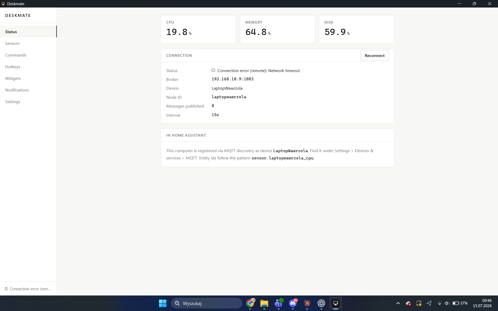
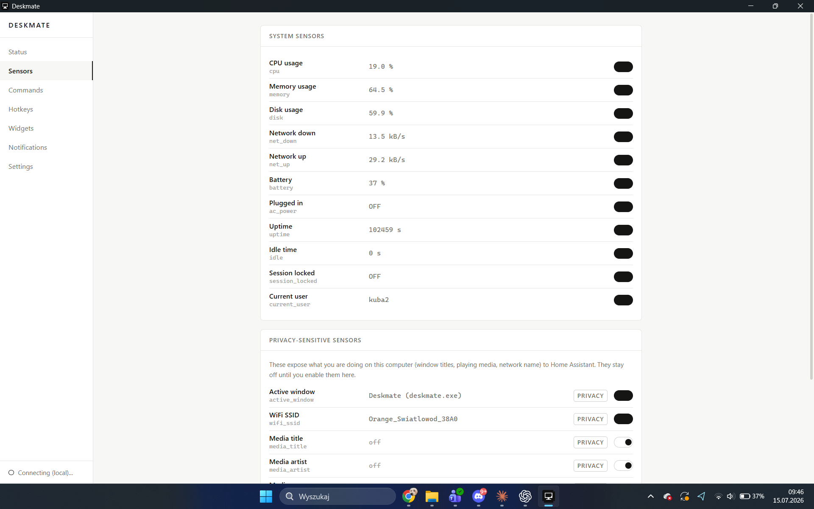
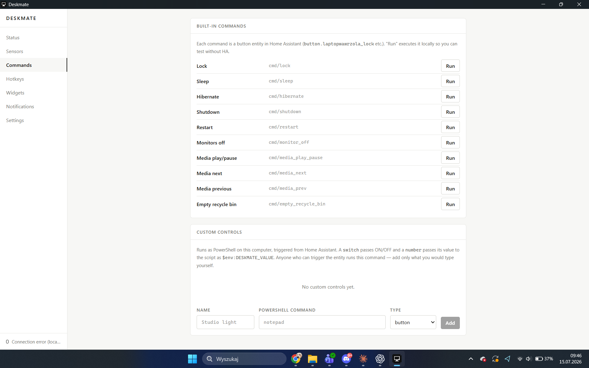
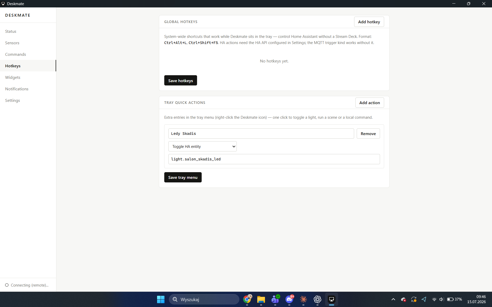
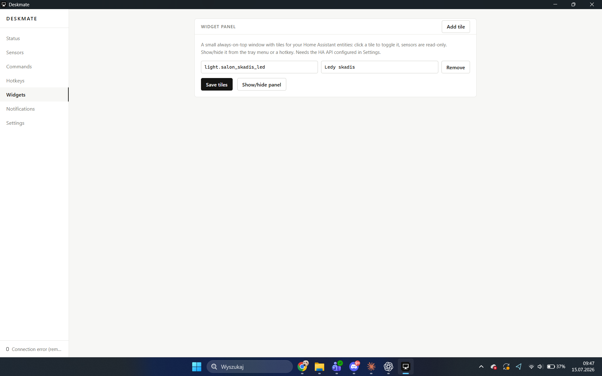
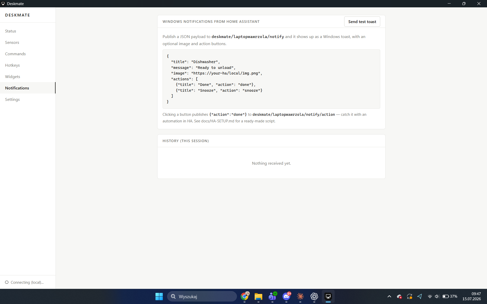

# Deskmate

A modern, open-source Windows companion for Home Assistant, in the spirit of
HASS.Agent. Your PC shows up in Home Assistant as a device with sensors,
buttons, switches and notifications, your keyboard becomes a remote for your
home, and your phone can drop files straight onto the PC.

It talks to its own Home Assistant integration over one encrypted connection,
so there is no MQTT broker to set up (MQTT still works if you already run one).
Native on Windows 10 and 11, **x64 and ARM64** (Snapdragon laptops included),
with a ~3 MB installer.

**New here? Read the [guide](docs/GUIDE.md).** It goes from installing to
automations in one place.

[](https://my.home-assistant.io/redirect/hacs_repository/?owner=JakubWawrzola&repository=deskmate&category=integration)

The button works once the repository has been added to HACS as a custom
repository (step 1 below); HACS does not add an unknown repository from a link.

## Quick start (about 5 minutes)

1. **Home Assistant:** HACS → three dots → *Custom repositories* → add
   `https://github.com/JakubWawrzola/deskmate` as *Integration*. Download
   **Deskmate**, restart Home Assistant.
2. **Home Assistant:** *Settings → Devices & services → Add integration →
   Deskmate*. Copy the pairing code it shows (`DMP1.…`).
3. **PC:** install `Deskmate_<version>_x64-setup.exe` or `_arm64-setup.exe`
   from [Releases](https://github.com/JakubWawrzola/deskmate/releases), paste
   the code, *Connect*. The PC appears as a device in Home Assistant.

Setting this up with an AI assistant? Point it at
[docs/AI-DEPLOY.md](docs/AI-DEPLOY.md).

## Screenshots

| Status | Sensors | Commands |
|---|---|---|
|  |  |  |

| Hotkeys | Widgets | Notifications |
|---|---|---|
|  |  |  |

## What it does

**In Home Assistant**

- Sensors: CPU, memory, disks, network, battery, uptime, idle time, locked,
  current user, "presenting or full screen", plus GPU, VRAM and temperatures
  where the hardware allows.
- Privacy-sensitive sensors, off until you enable them: window title, Wi-Fi
  name, now playing, camera and microphone in use.
- Buttons and controls: lock, sleep, hibernate, shutdown, restart, monitors off,
  media keys, volume, mute, keep awake, and your own PowerShell commands as
  buttons, switches or sliders.
- Native Windows notifications with an image and action buttons; the clicked
  button comes back as an event.
- A **Deskmate** page in the sidebar: send files from your phone or laptop to the
  PC, download from folders the PC shares, see every paired computer.

**On the PC**

- Global hotkeys that control your home or fire events into Home Assistant.
- An always-on-top widget panel with the entities you pick.
- Your own quick actions in the tray menu, and a separate
  [Stream Deck plugin](streamdeck-plugin/README.md).

Several computers and several Windows users on one computer are supported; see
the [guide](docs/GUIDE.md#10-several-computers-several-windows-users).

## Security in short

- One encrypted connection from the PC to Home Assistant: an X25519 exchange
  with fresh keys every session, AES-256-GCM frames, replay protection, optional
  second cipher layer. Keys live in Windows Credential Manager.
- Anything that reveals what you do or lets Home Assistant act beyond the
  built-in buttons is off until you turn it on, and much of it can ask on the PC
  first.
- No PowerShell for notifications, no telemetry. The only call home is an
  optional daily look at GitHub for a newer release.

The threat model, including what it does not protect against:
[docs/SECURITY.md](docs/SECURITY.md).

## Why not HASS.Agent?

If HASS.Agent or its [active fork](https://github.com/hass-agent/HASS.Agent)
already does what you need, use it. Deskmate exists because of two gaps I kept
hitting: no native ARM64 build, and a handful of entities I wanted
(camera and mic in use, keep awake as a switch, hotkeys as Home Assistant
events, a widget panel, files from the phone).

## Documentation

- [docs/GUIDE.md](docs/GUIDE.md): the guide, start here
- [docs/LINK.md](docs/LINK.md): the connection, pairing, remote access, protocol
- [docs/SECURITY.md](docs/SECURITY.md): threat model and defaults
- [docs/HA-SETUP.md](docs/HA-SETUP.md) and [docs/MIGRATION.md](docs/MIGRATION.md):
  the MQTT route, and moving from it
- [CHANGELOG.md](CHANGELOG.md) and [docs/releases/](docs/releases/): release history
- [docs/dev/](docs/dev/) and [HANDOFF.md](HANDOFF.md): architecture and notes
  for contributors

## Building from source

```
npm install
npm run tauri dev            # development
npm run tauri build          # release for the current architecture
npm run tauri build -- --target x86_64-pc-windows-msvc   # cross to x64
```

Toolchain: Node 20+, Rust stable (`aarch64-pc-windows-msvc` and/or
`x86_64-pc-windows-msvc`). No C compiler needed on either architecture.

## License

MIT
