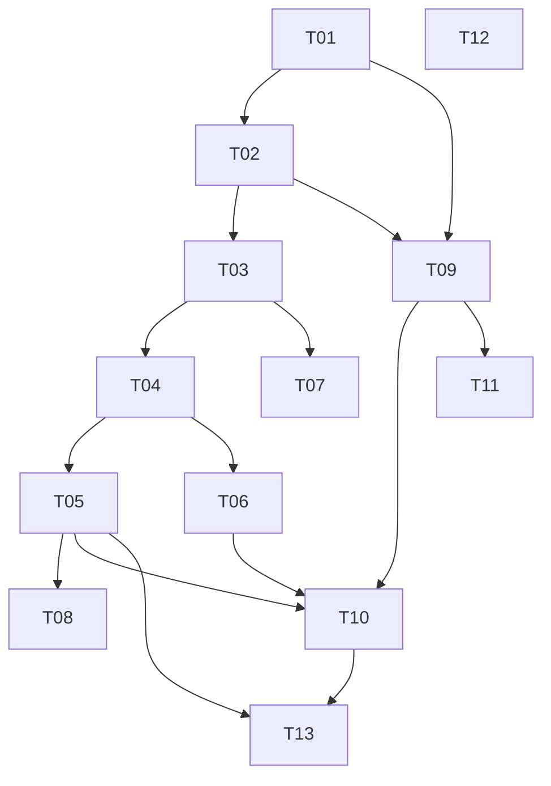

# Deskmate — plan wdrozenia (PRD breakdown)

Nowoczesny zamiennik HASS.Agent dla Windows 11 (x64 + ARM64).
Tauri 2 + React + TypeScript + Tailwind (frontend), Rust (backend).
Integracja z Home Assistant przez MQTT discovery. Open source — zero hardcode.

## 1. Przyjete zalozenia

- **Nazwa robocza**: Deskmate (latwa do zmiany — jedno miejsce: `src-tauri/tauri.conf.json` + stale w `src-tauri/src/consts.rs`).
- **Stack**: Tauri 2 (Rust) + React 18 + TS + Tailwind 4 — bo dziala natywnie na ARM64 i x64, malutki binarny, a Jakub zna Tauri z vault-managera.
- **Transport**: MQTT (rumqttc) + HA MQTT Discovery — jak HASS.Agent, bo dziala z waniliowym HA bez customowej integracji. Setup = adres brokera + login, nic wiecej.
- **Media player**: encja `media_player` wymagalaby customowej integracji HA. Zamiast tego: sensory SMTC (tytul/artysta/status) + przyciski sterowania przez discovery. Pelna encja media_player = ROADMAP.
- **Powiadomienia**: HA -> MQTT topic `deskmate/<device>/notify` -> toast Windows z obrazem. W repo gotowy przyklad skryptu `notify.deskmate` (mqtt.publish) do wklejenia w HA.
- **Konfiguracja**: `%APPDATA%\Deskmate\config.json`. Haslo MQTT w Windows Credential Manager (keyring) — nie plaintext.
- **Prywatnosc**: sensory wrazliwe (aktywne okno, media, kamera/mikrofon w uzyciu) DOMYSLNIE WYLACZONE, wlaczane swiadomie w UI (zgoda per sensor).
- **Custom komendy**: PowerShell z configu, z ostrzezeniem w UI (wektor RCE — user musi rozumiec, ze HA moze wykonac kod na PC).
- **Stream Deck**: tylko plan (docs/STREAMDECK-PLAN.md), zero implementacji teraz.
- **Jezyk UI**: angielski (open source), architektura gotowa pod i18n pozniej.
- **Licencja**: MIT.

## 2. Taski

## [x] T01 — Scaffold projektu
Zakres: struktura Tauri 2 + React + TS + Tailwind; `package.json`, `src-tauri/` (Cargo.toml, tauri.conf.json, main.rs), `src/` (App.tsx), vite. Git init.
Zalezy od: —
Rozmiar: M | Ryzyko: niskie
Definition of done: `npm run tauri dev` odpala okno z placeholderem (NIE uruchamiac — Jakub testuje).
DO PRZETESTOWANIA (Jakub):
1. `cd C:\dev\web\deskmate && npm install && npm run tauri dev` — otwiera sie okno aplikacji.

## [x] T02 — Config store (Rust)
Zakres: `src-tauri/src/config.rs` — model AppConfig (serde), zapis/odczyt `%APPDATA%\Deskmate\config.json`, haslo w keyring; komendy tauri `get_config`/`save_config`.
Zalezy od: T01
Rozmiar: S | Ryzyko: niskie
Definition of done: config zapisuje sie i wczytuje po restarcie; brak hasla w JSON.
DO PRZETESTOWANIA (Jakub):
1. Zapisz ustawienia w aplikacji, zamknij i otworz — wartosci sa; w `%APPDATA%\Deskmate\config.json` NIE ma hasla.

## [x] T03 — MQTT core (Rust)
Zakres: `src-tauri/src/mqtt.rs` — rumqttc AsyncClient, auto-reconnect, LWT availability (`deskmate/<device>/availability` online/offline), eventy statusu do UI (tauri emit).
Zalezy od: T02
Rozmiar: M | Ryzyko: srednie (reconnect edge-cases)
Definition of done: po podaniu brokera app laczy sie i utrzymuje polaczenie; status widoczny w UI.
DO PRZETESTOWANIA (Jakub):
1. Podaj broker (HAOS: IP RPi, port 1883, user/haslo z dodatku Mosquitto) — status "Connected".
2. Wylacz WiFi na 30 s i wlacz — status wraca do "Connected" sam.

## [x] T04 — HA MQTT Discovery
Zakres: `src-tauri/src/discovery.rs` — rejestracja device + encji (sensor/binary_sensor/button/number/switch) na `homeassistant/<comp>/<node>/<obj>/config`, availability + expire_after.
Zalezy od: T03
Rozmiar: M | Ryzyko: srednie (format discovery)
Definition of done: w HA pojawia sie urzadzenie "Deskmate <hostname>" z encjami.
DO PRZETESTOWANIA (Jakub):
1. HA -> Ustawienia -> Urzadzenia -> MQTT — jest urzadzenie z nazwa komputera, encje maja wartosci.

## [x] T05 — Sensory systemowe
Zakres: `src-tauri/src/sensors/` — sysinfo: CPU %, RAM %, dysk %, siec KB/s, bateria %, uptime, user; windows: aktywne okno (opt-in), idle time, sesja zablokowana, SSID WiFi (opt-in); petla publikacji co 15 s (konfigurowalne).
Zalezy od: T04
Rozmiar: L | Ryzyko: srednie (WinAPI na ARM64)
Definition of done: encje w HA aktualizuja sie; sensory opt-in nie publikuja bez zgody.
DO PRZETESTOWANIA (Jakub):
1. HA: sensor CPU zmienia sie po obciazeniu komputera.
2. Sensor "Active window" nie istnieje w HA dopoki nie wlaczysz go w Deskmate -> Sensors.
3. Zablokuj komputer (Win+L) — binary_sensor "Session locked" = on.

## [x] T06 — Komendy
Zakres: `src-tauri/src/commands/` — buttony discovery: shutdown, restart, sleep, hibernate, lock, monitor off; number: volume; custom komendy PowerShell z configu (kazda = button w HA).
Zalezy od: T04
Rozmiar: M | Ryzyko: wysokie (wykonywanie komend zdalnie — walidacja, brak eval z MQTT: wykonujemy TYLKO predefiniowane/skonfigurowane, nigdy tresci z payloadu)
Definition of done: przycisk w HA blokuje komputer; payload MQTT nie moze wstrzyknac wlasnej komendy.
DO PRZETESTOWANIA (Jakub):
1. HA: nacisnij "Lock" — komputer sie blokuje.
2. HA: suwak Volume — glosnosc zmienia sie na zywo.
3. Dodaj custom komende `notepad` w Deskmate, nacisnij button w HA — otwiera sie notatnik.

## [x] T07 — Powiadomienia (toast z obrazem)
Zakres: `src-tauri/src/notify.rs` — subskrypcja `deskmate/<device>/notify`, JSON {title, message, image?}; toast WinRT z pobranym obrazem; przyklad HA `script.notify_pc` w docs/HA-SETUP.md.
Zalezy od: T03
Rozmiar: M | Ryzyko: srednie (WinRT toast na ARM64)
Definition of done: mqtt.publish z HA pokazuje toast z tytulem, trescia i obrazkiem.
DO PRZETESTOWANIA (Jakub):
1. HA Developer Tools -> uslugi -> mqtt.publish na topic `deskmate/<host>/notify` z payload `{"title":"Zmywarka","message":"Jest do rozpakowania","image":"https://dom.example.com/local/ikony/zmywarka.png"}` — toast z obrazkiem.

## [x] T08 — Media (SMTC)
Zakres: `src-tauri/src/media.rs` — GlobalSystemMediaTransportControlsSessionManager: sensory (tytul, artysta, aplikacja, status) opt-in + buttony play/pause/next/prev.
Zalezy od: T04, T05
Rozmiar: M | Ryzyko: srednie (WinRT async)
Definition of done: puszczasz muzyke w Spotify — HA widzi tytul; button pauzuje.
DO PRZETESTOWANIA (Jakub):
1. Wlacz muzyke (Spotify/YouTube) — sensor Media title w HA pokazuje utwor.
2. HA: button "Media play/pause" — muzyka staje.

## [x] T09 — UI shell + design tokens + wizard
Zakres: `src/` — layout (sidebar/rail), tokens monochrom (bialo-czarny jak dashboard Dom/budzet), pierwszy start = wizard (broker/port/user/haslo/nazwa urzadzenia, test polaczenia).
Zalezy od: T01, T02
Rozmiar: M | Ryzyko: niskie
Definition of done: swiezy start prowadzi przez wizard do polaczenia; UI spojne z Dom/budzet.
DO PRZETESTOWANIA (Jakub):
1. Usun `%APPDATA%\Deskmate\config.json`, odpal app — wizard; po nim status Connected.

## [x] T10 — UI strony
Zakres: `src/pages/` — Status (polaczenie, device, licznik publikacji), Sensors (lista + toggle + podglad wartosci + privacy), Commands (lista + dodawanie custom), Notifications (historia ostatnich), Settings (broker, interwal, autostart).
Zalezy od: T09, T05, T06
Rozmiar: L | Ryzyko: niskie
Definition of done: kazda strona dziala na zywych danych z backendu.
DO PRZETESTOWANIA (Jakub):
1. Sensors: wylacz "CPU" — encja w HA przechodzi w unavailable po expire.
2. Notifications: wyslij toast z HA — pojawia sie w historii.

## [x] T11 — Tray + autostart
Zakres: tray icon (status kolorem), menu (Open/Pause/Quit), zamkniecie okna = minimalizacja do traya, autostart z Windows (tauri plugin autostart, toggle w Settings).
Zalezy od: T09
Rozmiar: S | Ryzyko: niskie
DO PRZETESTOWANIA (Jakub):
1. Zamknij okno — app zostaje w trayu, sensory dalej publikuja.
2. Wlacz autostart, zrestartuj komputer — Deskmate wstaje sam (w trayu).

## [x] T12 — Dokumentacja open source
Zakres: README.md (EN, instalacja, screenshoty TODO), docs/ARCHITECTURE.md, docs/HA-SETUP.md (Mosquitto + notify script yaml), docs/STREAMDECK-PLAN.md, docs/ROADMAP.md (schowek plikow/tekstu, media_player, inne urzadzenia), LICENSE (MIT), HANDOFF.md.
Zalezy od: — (rownolegle)
Rozmiar: M | Ryzyko: niskie

## [x] T13 — Build release x64 + ARM64
Zakres: `npm run tauri build` dla aarch64 (ten laptop) + `--target x86_64-pc-windows-msvc` (Ryzen); instrukcja w README; NSIS installer.
Zalezy od: wszystkie
Rozmiar: M | Ryzyko: srednie (cross-target bundle)
DO PRZETESTOWANIA (Jakub):
1. Zainstaluj installer ARM64 na zenbooku — dziala.
2. Zainstaluj x64 na Ryzenie — dziala; oba widoczne jako OSOBNE urzadzenia w HA.

## 3. Graf zaleznosci



Sciezka krytyczna: T01 -> T02 -> T03 -> T04 -> T05 -> T10 -> T13.
Rownolegle mozliwe: T12 (docs) w kazdej chwili; T07 obok T05/T06; T09 obok T03/T04.

## 4. Ship order — milestony

```
M1 "Szkielet zywy":     T01, T02, T09 -> okno + wizard + config
M2 "Widoczny w HA":     T03, T04, T05 -> device z sensorami w HA
M3 "Sterowanie":        T06, T07      -> komendy + powiadomienia toast
M4 "Media + pelne UI":  T08, T10, T11 -> media, strony, tray, autostart
M5 "Open source ready": T12, T13      -> docs + release builds
```

Milestone DO PRZETESTOWANIA — patrz sekcje taskow. Kryterium "mozna pokazac": M2 = tak (device w HA), M3 = wow-efekt (toast z obrazkiem).

## 5. Plan testow — wylacznie manualne (Jakub)

Smoke po M2: instalacja -> wizard -> Connected -> device w HA -> CPU zmienia wartosc.
Smoke po M3: Lock z HA dziala; toast z obrazem dziala.
Przed publikacja open source: swiezy Windows bez HA (musi dzialac wizard i czytelny blad polaczenia), oba targety (ARM64+x64), test bez internetu (app nie crashuje).
Pokryte przez tsc/lint/cargo check: literowki typow, importy — Jakub NIE testuje.

## 6. Otwarte decyzje (nieodwracalne/kosztowne)

- Ostateczna NAZWA projektu przed publikacja na GitHub (Deskmate = robocza; zmiana pozniej = rename repo + identyfikatory MQTT).
- Podpisywanie binarek (code signing cert = koszt) — bez podpisu SmartScreen straszy przy instalacji.

## Backlog (nie implementowac teraz)

- Pelna encja media_player (wymaga customowej integracji HA albo HACS mqtt-mediaplayer).
- Schowek tymczasowy: przesylanie plikow/tekstu PC <-> HA <-> telefon (topic + www/deskmate/).
- Stream Deck plugin (patrz docs/STREAMDECK-PLAN.md).
- Webcam/mic in-use sensor (Windows capability access manager).
- Per-monitor screenshot na zadanie (privacy-sensitive, opt-in).
- i18n (PL/EN).
- Aktualizacje auto (tauri updater).
