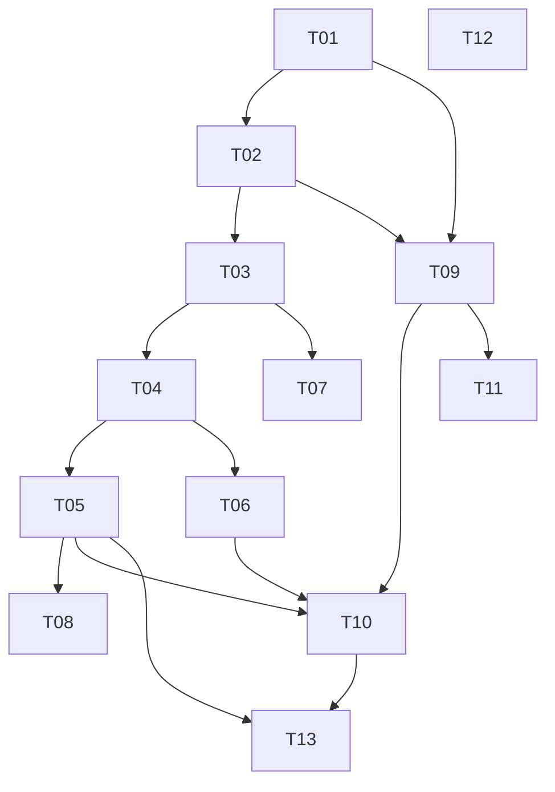

# Deskmate — deployment plan (PRD breakdown)

A modern HASS.Agent replacement for Windows 11 (x64 + ARM64).
Tauri 2 + React + TypeScript + Tailwind (frontend), Rust (backend).
Home Assistant integration via MQTT discovery. Open source — zero hardcoding.

## 1. Assumptions

- **Working name**: Deskmate (easy to change — a single place: `src-tauri/tauri.conf.json` + constants in `src-tauri/src/consts.rs`).
- **Stack**: Tauri 2 (Rust) + React 18 + TS + Tailwind 4 — because it runs natively on ARM64 and x64, produces a tiny binary, and Jakub already knows Tauri from vault-manager.
- **Transport**: MQTT (rumqttc) + HA MQTT Discovery — like HASS.Agent, because it works with vanilla HA without a custom integration. Setup = broker address + login, nothing more.
- **Media player**: a `media_player` entity would require a custom HA integration. Instead: SMTC sensors (title/artist/status) + control buttons via discovery. A full media_player entity = ROADMAP.
- **Notifications**: HA -> MQTT topic `deskmate/<device>/notify` -> Windows toast with an image. The repo includes a ready-made example script `notify.deskmate` (mqtt.publish) to paste into HA.
- **Configuration**: `%APPDATA%\Deskmate\config.json`. MQTT password in Windows Credential Manager (keyring) — not plaintext.
- **Privacy**: sensitive sensors (active window, media, camera/microphone in use) DISABLED BY DEFAULT, enabled deliberately in the UI (per-sensor consent).
- **Custom commands**: PowerShell from config, with a UI warning (an RCE vector — the user must understand that HA can execute code on the PC).
- **Stream Deck**: plan only (docs/STREAMDECK-PLAN.md), no implementation yet.
- **UI language**: English (open source), architecture ready for i18n later.
- **License**: MIT.

## 2. Tasks

## [x] T01 — Project scaffold
Scope: Tauri 2 + React + TS + Tailwind structure; `package.json`, `src-tauri/` (Cargo.toml, tauri.conf.json, main.rs), `src/` (App.tsx), vite. Git init.
Depends on: —
Size: M | Risk: low
Definition of done: `npm run tauri dev` opens a window with a placeholder (DO NOT run it — Jakub tests).
TO TEST (Jakub):
1. `cd C:\dev\web\deskmate && npm install && npm run tauri dev` — the app window opens.

## [x] T02 — Config store (Rust)
Scope: `src-tauri/src/config.rs` — AppConfig model (serde), save/load `%APPDATA%\Deskmate\config.json`, password in keyring; tauri commands `get_config`/`save_config`.
Depends on: T01
Size: S | Risk: low
Definition of done: config saves and loads after restart; no password in the JSON.
TO TEST (Jakub):
1. Save settings in the app, close and reopen — values are there; `%APPDATA%\Deskmate\config.json` has NO password.

## [x] T03 — MQTT core (Rust)
Scope: `src-tauri/src/mqtt.rs` — rumqttc AsyncClient, auto-reconnect, LWT availability (`deskmate/<device>/availability` online/offline), status events to the UI (tauri emit).
Depends on: T02
Size: M | Risk: medium (reconnect edge cases)
Definition of done: after entering the broker the app connects and stays connected; status visible in the UI.
TO TEST (Jakub):
1. Enter the broker (HAOS: RPi IP, port 1883, user/password from the Mosquitto add-on) — status "Connected".
2. Turn off WiFi for 30 s and turn it back on — status returns to "Connected" on its own.

## [x] T04 — HA MQTT Discovery
Scope: `src-tauri/src/discovery.rs` — register the device + entities (sensor/binary_sensor/button/number/switch) at `homeassistant/<comp>/<node>/<obj>/config`, availability + expire_after.
Depends on: T03
Size: M | Risk: medium (discovery format)
Definition of done: a device "Deskmate <hostname>" with entities appears in HA.
TO TEST (Jakub):
1. HA -> Settings -> Devices -> MQTT — the device with the computer's name is there, entities have values.

## [x] T05 — System sensors
Scope: `src-tauri/src/sensors/` — sysinfo: CPU %, RAM %, disk %, network KB/s, battery %, uptime, user; windows: active window (opt-in), idle time, session locked, WiFi SSID (opt-in); publish loop every 15 s (configurable).
Depends on: T04
Size: L | Risk: medium (WinAPI on ARM64)
Definition of done: entities update in HA; opt-in sensors don't publish without consent.
TO TEST (Jakub):
1. HA: the CPU sensor changes value under computer load.
2. The "Active window" sensor doesn't exist in HA until you enable it in Deskmate -> Sensors.
3. Lock the computer (Win+L) — binary_sensor "Session locked" = on.

## [x] T06 — Commands
Scope: `src-tauri/src/commands/` — discovery buttons: shutdown, restart, sleep, hibernate, lock, monitor off; number: volume; custom PowerShell commands from config (each = a button in HA).
Depends on: T04
Size: M | Risk: high (executing commands remotely — validation, no eval from MQTT: we execute ONLY predefined/configured commands, never content from the payload)
Definition of done: a button in HA locks the computer; the MQTT payload cannot inject an arbitrary command.
TO TEST (Jakub):
1. HA: press "Lock" — the computer locks.
2. HA: the Volume slider — volume changes live.
3. Add a custom command `notepad` in Deskmate, press the button in HA — Notepad opens.

## [x] T07 — Notifications (toast with image)
Scope: `src-tauri/src/notify.rs` — subscribes to `deskmate/<device>/notify`, JSON {title, message, image?}; WinRT toast with a downloaded image; example HA `script.notify_pc` in docs/HA-SETUP.md.
Depends on: T03
Size: M | Risk: medium (WinRT toast on ARM64)
Definition of done: mqtt.publish from HA shows a toast with title, message, and image.
TO TEST (Jakub):
1. HA Developer Tools -> Services -> mqtt.publish on topic `deskmate/<host>/notify` with payload `{"title":"Dishwasher","message":"Needs unloading","image":"https://dom.wawrzola.com/local/ikony/zmywarka.png"}` — a toast with the image appears.

## [x] T08 — Media (SMTC)
Scope: `src-tauri/src/media.rs` — GlobalSystemMediaTransportControlsSessionManager: sensors (title, artist, app, status) opt-in + play/pause/next/prev buttons.
Depends on: T04, T05
Size: M | Risk: medium (WinRT async)
Definition of done: play music in Spotify — HA sees the title; the button pauses it.
TO TEST (Jakub):
1. Play music (Spotify/YouTube) — the Media title sensor in HA shows the track.
2. HA: "Media play/pause" button — the music stops.

## [x] T09 — UI shell + design tokens + wizard
Scope: `src/` — layout (sidebar/rail), monochrome tokens (black-and-white like the Home/Budget dashboard), first launch = wizard (broker/port/user/password/device name, connection test).
Depends on: T01, T02
Size: M | Risk: low
Definition of done: a fresh start walks through the wizard to a connection; UI consistent with Home/Budget.
TO TEST (Jakub):
1. Delete `%APPDATA%\Deskmate\config.json`, launch the app — wizard appears; afterward status is Connected.

## [x] T10 — UI pages
Scope: `src/pages/` — Status (connection, device, publish counter), Sensors (list + toggle + value preview + privacy), Commands (list + add custom), Notifications (recent history), Settings (broker, interval, autostart).
Depends on: T09, T05, T06
Size: L | Risk: low
Definition of done: every page works with live data from the backend.
TO TEST (Jakub):
1. Sensors: disable "CPU" — the entity in HA goes unavailable after expiry.
2. Notifications: send a toast from HA — it appears in the history.

## [x] T11 — Tray + autostart
Scope: tray icon (status by color), menu (Open/Pause/Quit), closing the window = minimize to tray, autostart with Windows (tauri plugin autostart, toggle in Settings).
Depends on: T09
Size: S | Risk: low
TO TEST (Jakub):
1. Close the window — the app stays in the tray, sensors keep publishing.
2. Enable autostart, restart the computer — Deskmate starts on its own (in the tray).

## [x] T12 — Open source documentation
Scope: README.md (EN, installation, screenshots TODO), docs/ARCHITECTURE.md, docs/HA-SETUP.md (Mosquitto + notify script yaml), docs/STREAMDECK-PLAN.md, docs/ROADMAP.md (file/text clipboard, media_player, other devices), LICENSE (MIT), HANDOFF.md.
Depends on: — (parallel)
Size: M | Risk: low

## [x] T13 — x64 + ARM64 release build
Scope: `npm run tauri build` for aarch64 (this laptop) + `--target x86_64-pc-windows-msvc` (Ryzen); instructions in README; NSIS installer.
Depends on: all
Size: M | Risk: medium (cross-target bundling)
TO TEST (Jakub):
1. Install the ARM64 installer on the Zenbook — it works.
2. Install x64 on the Ryzen — it works; both show up as SEPARATE devices in HA.

## 3. Dependency graph



Critical path: T01 -> T02 -> T03 -> T04 -> T05 -> T10 -> T13.
Parallelizable: T12 (docs) at any time; T07 alongside T05/T06; T09 alongside T03/T04.

## 4. Ship order — milestones

```
M1 "Living skeleton":      T01, T02, T09 -> window + wizard + config
M2 "Visible in HA":        T03, T04, T05 -> device with sensors in HA
M3 "Control":              T06, T07      -> commands + toast notifications
M4 "Media + full UI":      T08, T10, T11 -> media, pages, tray, autostart
M5 "Open source ready":    T12, T13      -> docs + release builds
```

Milestone TO TEST — see task sections. "Demoable" criterion: M2 = yes (device in HA), M3 = wow effect (toast with image).

## 5. Test plan — manual only (Jakub)

Smoke test after M2: install -> wizard -> Connected -> device in HA -> CPU value changes.
Smoke test after M3: Lock from HA works; toast with image works.
Before open source publication: fresh Windows without HA (wizard must work and show a clear connection error), both targets (ARM64+x64), test without internet (app doesn't crash).
Covered by tsc/lint/cargo check: type typos, imports — Jakub does NOT test these.

## 6. Open decisions (irreversible/costly)

- Final project NAME before publishing on GitHub (Deskmate = working name; changing it later = repo rename + MQTT identifiers).
- Binary signing (code signing cert = cost) — without signing, SmartScreen warns during install.

## Backlog (not implementing now)

- Full media_player entity (requires a custom HA integration or HACS mqtt-mediaplayer).
- Temporary clipboard: file/text transfer PC <-> HA <-> phone (topic + www/deskmate/).
- Stream Deck plugin (see docs/STREAMDECK-PLAN.md).
- Webcam/mic in-use sensor (Windows capability access manager).
- On-demand per-monitor screenshot (privacy-sensitive, opt-in).
- i18n (PL/EN).
- Auto updates (tauri updater).
